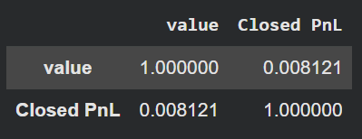
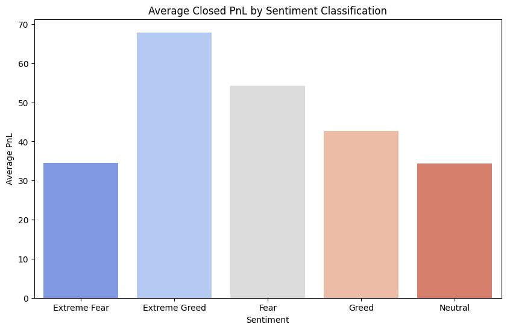
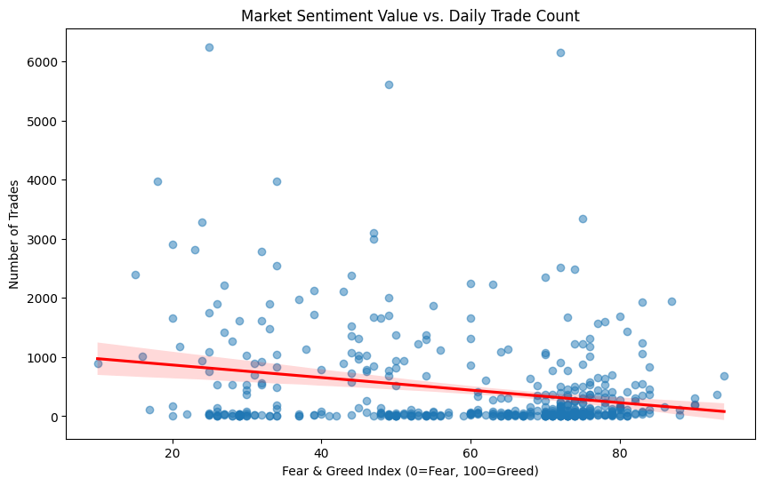
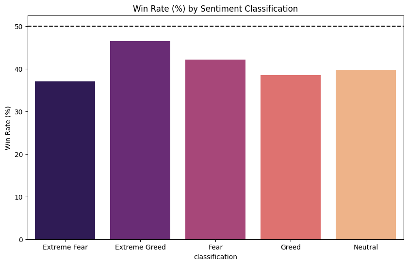
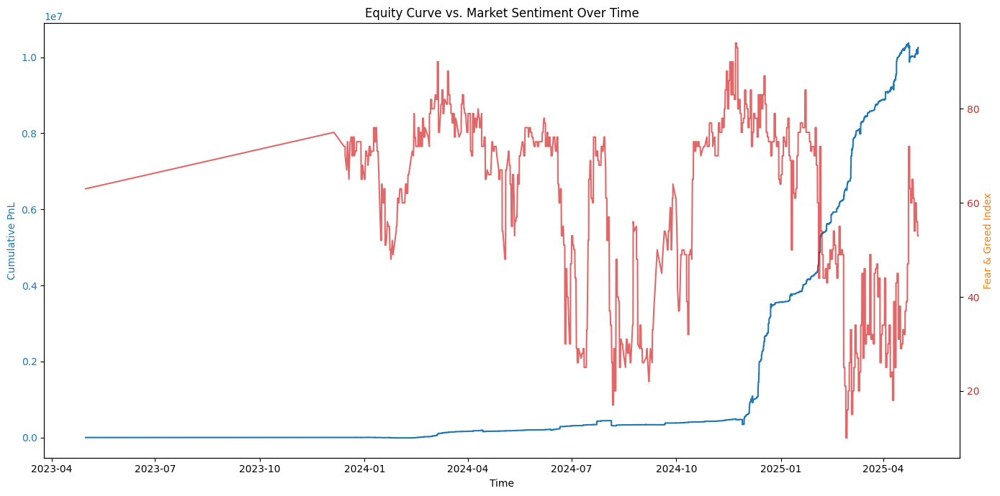
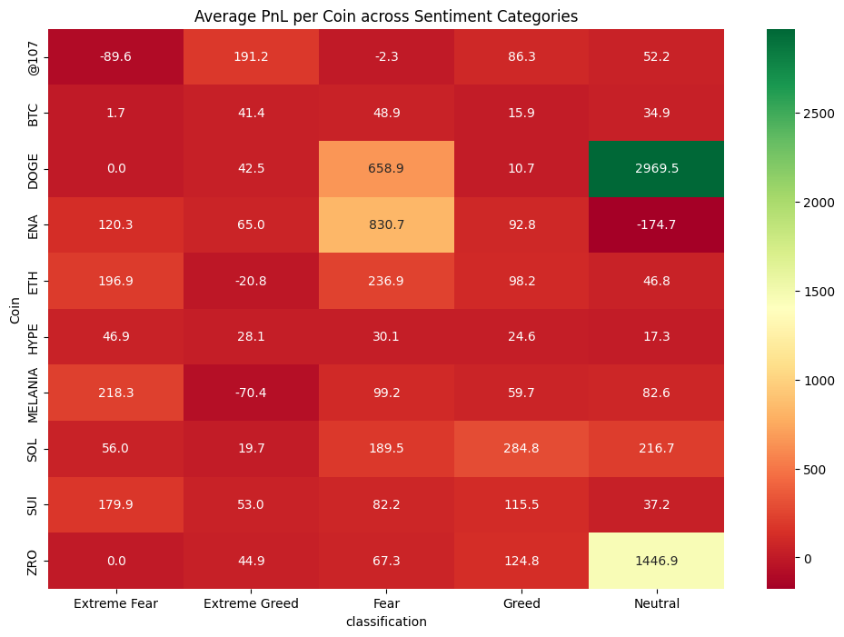
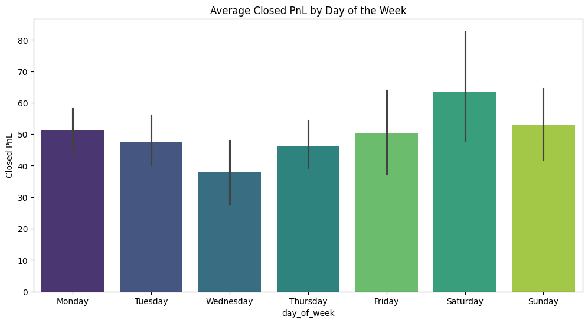
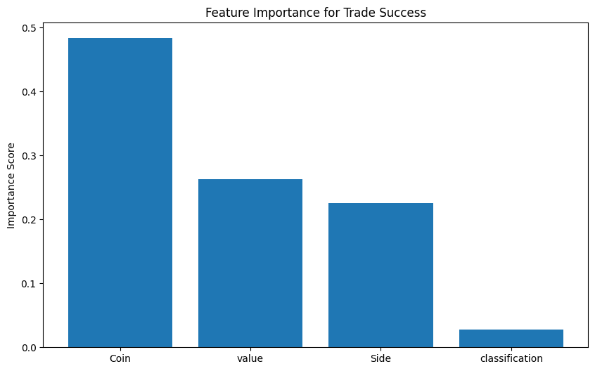

# 📈 Sentiment-Aware Crypto Trading Intelligence System

## Overview

This project explores the relationship between cryptocurrency market sentiment and trader performance using real-world trading activity and the Fear & Greed Index.

The goal is to understand how market psychology influences trading behavior, profitability, win rates, and asset-specific performance while also developing a machine learning model capable of predicting trade success.

The project combines Exploratory Data Analysis (EDA), behavioral finance insights, market sentiment analysis, predictive modeling, and deployment-ready machine learning artifacts.

---

## Business Problem

Financial markets are heavily influenced by investor sentiment. Fear and Greed often drive decision-making, volatility, and trading activity.

This project investigates:

* Does market sentiment affect trader profitability?
* Do traders behave differently during Fear and Greed periods?
* Which assets perform best under different sentiment regimes?
* Can we predict whether a trade will be profitable using sentiment and trading information?

The objective is to generate actionable insights that can support smarter trading strategies.

---

## Datasets

### 1. Bitcoin Market Sentiment Dataset

Contains daily Fear & Greed Index values and sentiment classifications.

Features:

* Timestamp
* Sentiment Value
* Sentiment Classification
* Date

### 2. Historical Trader Dataset

Contains detailed trading activity records.

Features:

* Account
* Coin
* Execution Price
* Position Size
* Trade Direction
* Closed PnL
* Fees
* Trade ID
* Timestamp
* And additional trade metadata

---

## Project Workflow

### Data Preparation

* Converted timestamps into datetime format
* Extracted date and time features
* Aligned trading records with sentiment data
* Merged datasets based on trading date
* Generated new analytical features such as:

  * Win/Loss indicator (`is_win`)
  * Day of Week
  * Hour of Trade

### Exploratory Data Analysis

Performed multiple analyses to uncover hidden relationships between market sentiment and trading outcomes.

### Machine Learning

Built a Random Forest Classifier to predict whether a trade would be profitable.

---

# Exploratory Data Analysis

## 1. Correlation Analysis

A correlation study was conducted between the Fear & Greed Index value and Closed PnL.

### Key Finding

The correlation coefficient was approximately:

```text
0.008
```

This indicates almost no direct linear relationship between market sentiment and trader profitability.

### Insight

Market sentiment alone does not directly explain trading success. Other factors such as asset selection, trade direction, timing, and strategy execution appear to play a larger role.

### Visualization



---

## 2. Profitability Across Sentiment Regimes

Average Closed PnL was analyzed across different sentiment classifications.

### Key Findings

* Extreme Greed generated the highest average profitability.
* Fear also produced strong profitability.
* Neutral and Extreme Fear conditions generated lower returns.

### Insight

Strong market trends during Extreme Greed appear to create favorable conditions for profitable trading, while Fear-driven volatility may create opportunities for contrarian strategies.

### Visualization



---

## 3. Market Sentiment vs Trading Activity

Daily trade counts were compared against the Fear & Greed Index.

### Key Findings

* Trading activity increased during Fear periods.
* Trading activity generally decreased as Greed increased.

### Insight

Fear appears to trigger more market participation, likely due to uncertainty, volatility, and position adjustments. Greed-dominated markets may encourage longer holding periods and fewer transactions.

### Visualization



---

## 4. Win Rate Analysis

The percentage of profitable trades was analyzed across sentiment classifications.

### Key Findings

* Extreme Greed achieved the highest win rate.
* Extreme Fear produced the lowest win rate.
* No sentiment category exceeded a 50% win rate.

### Insight

Despite relatively modest win rates, traders remained profitable overall because winning trades tended to outweigh losses in magnitude.

### Visualization



---

## 5. Equity Curve vs Market Sentiment

A cumulative profit curve was compared with the Fear & Greed Index over time.

### Key Findings

* Profitability evolved in distinct phases rather than steadily.
* Large profitability increases did not consistently align with sentiment extremes.

### Insight

This reinforces the earlier correlation findings and suggests that successful trading depends on execution quality and strategy selection rather than sentiment alone.

### Visualization



---

## 6. Coin-Specific Performance Analysis

Average profitability was analyzed for the top-performing assets under different sentiment regimes.

### Key Findings

* DOGE exhibited exceptionally strong performance under certain sentiment conditions.
* ENA displayed high sensitivity to market mood.
* ETH and SOL demonstrated relatively stable profitability.

### Insight

Different assets react differently to the same market conditions. Asset selection emerged as a critical driver of trading success.

### Visualization



---

## 7. Temporal Trading Analysis

Trading profitability was examined across days of the week.

### Key Findings

* Saturday generated the highest average profitability.
* Sunday also performed strongly.
* Wednesday exhibited the weakest performance.

### Insight

Crypto markets operate continuously, and weekend trading appears to offer unique opportunities compared to traditional financial markets.

### Visualization



---

# Machine Learning Model

## Objective

Predict whether a trade will be profitable.

### Target Variable

```python
is_win = Closed_PnL > 0
```

### Features Used

* Coin
* Trade Side
* Fear & Greed Index Value
* Sentiment Classification

### Model

Random Forest Classifier

---

## Model Performance

| Metric    | Score |
| --------- | ----- |
| Accuracy  | 81%   |
| Precision | 81%   |
| Recall    | 80%   |
| F1 Score  | 80%   |

### Interpretation

The model successfully identified meaningful patterns within trading behavior and market conditions, demonstrating that trade outcomes are not entirely random.

---

## Feature Importance Analysis

Feature importance scores revealed the strongest predictors of trade success.

### Ranking

1. Coin
2. Fear & Greed Value
3. Trade Side
4. Sentiment Classification

### Key Insight

Asset selection was the strongest predictor of profitability, significantly outweighing sentiment classifications.

This finding supports earlier EDA results showing that different assets behave differently under the same market conditions.

### Visualization



---

# Key Findings

### Market Sentiment Alone Is Not Enough

A near-zero correlation between sentiment and profitability suggests that market mood alone cannot explain trading outcomes.

### Fear Changes Behavior

Fearful markets generated significantly higher trading activity.

### Extreme Greed Produced The Best Results

Both average profitability and win rate peaked during Extreme Greed periods.

### Asset Selection Matters Most

Coin selection emerged as the most important factor influencing profitability.

### Weekend Trading Shows Potential

Saturday and Sunday produced the strongest average trading performance.

### Machine Learning Can Predict Trade Outcomes

The Random Forest model achieved approximately 81% accuracy in predicting winning trades.

---

# Technologies Used

* Python
* Pandas
* NumPy
* Matplotlib
* Seaborn
* Scikit-Learn
* Joblib
* Jupyter Notebook

---

# Project Structure

```text
Sentiment-Aware-Crypto-Trading-Intelligence/
│
├── models/
│   ├── trading_model.joblib
│   └── label_encoder.joblib
│
├── notebooks/
│   └── sentiment_vs_trading.ipynb
│
├── images/
│   ├── correlation_matrix.png
│   ├── pnl_by_sentiment.png
│   ├── sentiment_vs_trade_count.png
│   ├── win_rate_by_sentiment.png
│   ├── equity_curve_vs_sentiment.png
│   ├── coin_sentiment_heatmap.png
│   ├── feature_importance.png
│   └── pnl_by_day_of_week.png
│
├── predict_trade_success.py
├── requirements.txt
├── README.md
└── .gitignore
```

---

# Model Persistence

The trained machine learning model and encoder were serialized using Joblib.

```python
joblib.dump(model, 'models/trading_model.joblib')
joblib.dump(label_encoder, 'models/label_encoder.joblib')
```

This allows predictions to be generated without retraining the model.

---

# Future Improvements

* Incorporate leverage and position sizing features
* Develop real-time sentiment ingestion pipelines
* Build a Streamlit dashboard for interactive analysis
* Perform time-series forecasting
* Explore deep learning models for trade prediction
* Integrate live cryptocurrency market data

---

# Author

**Sudhanshu Roy**
